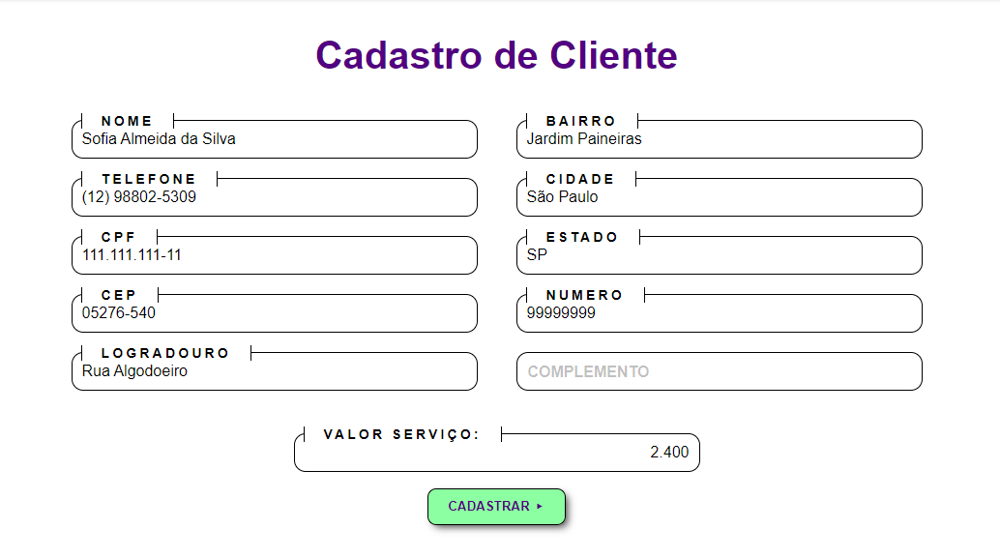
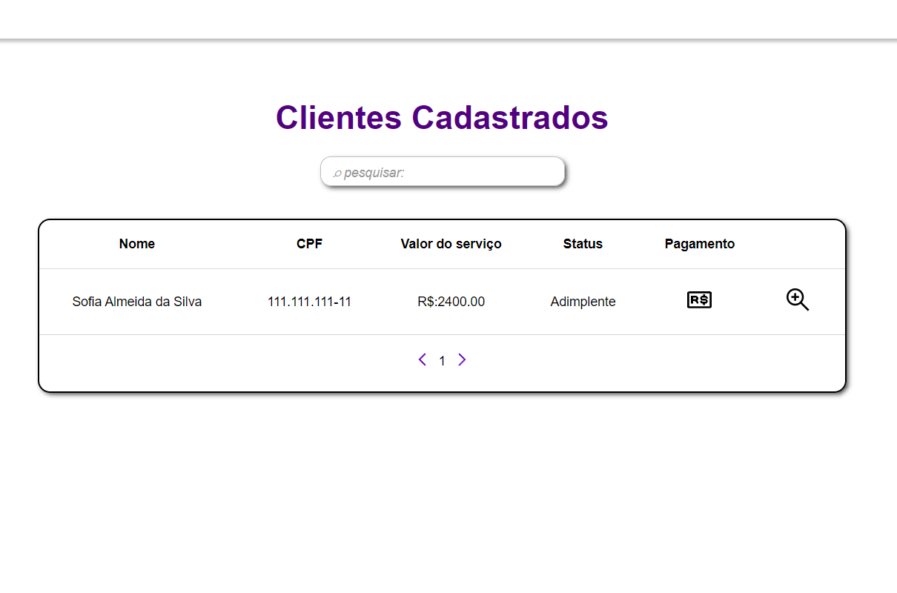
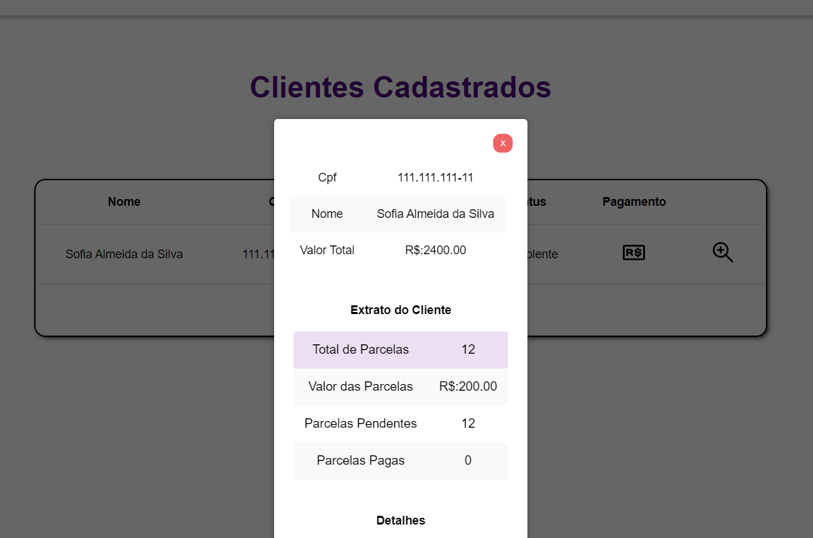
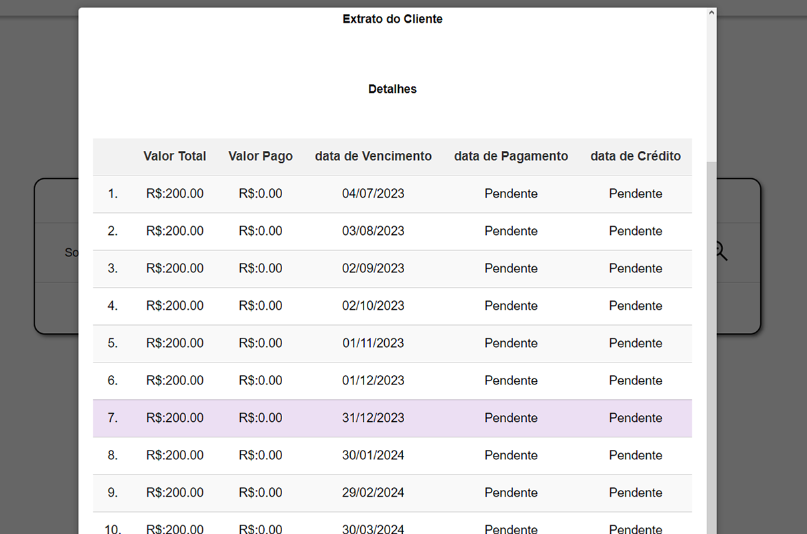
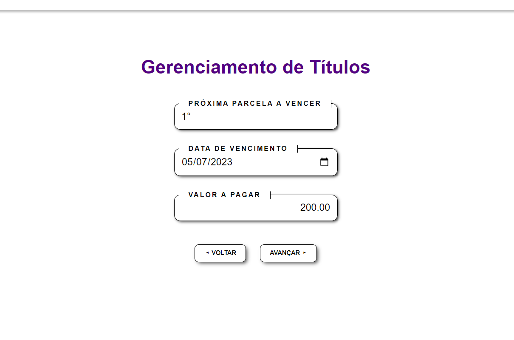
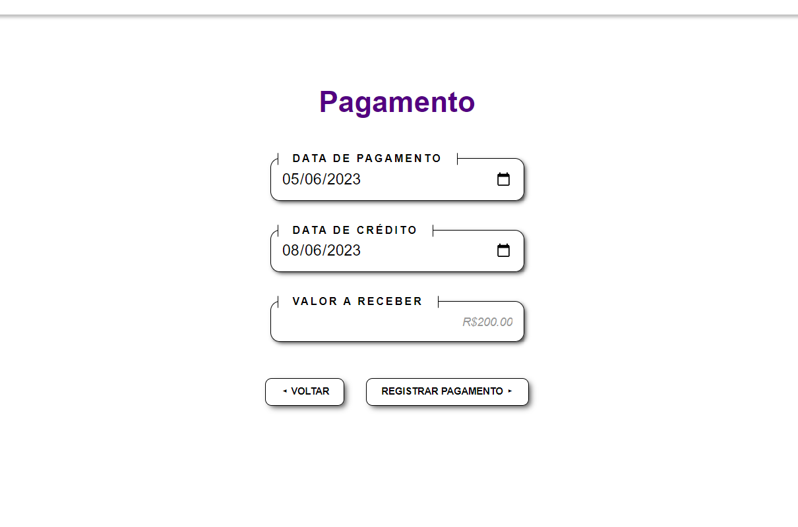
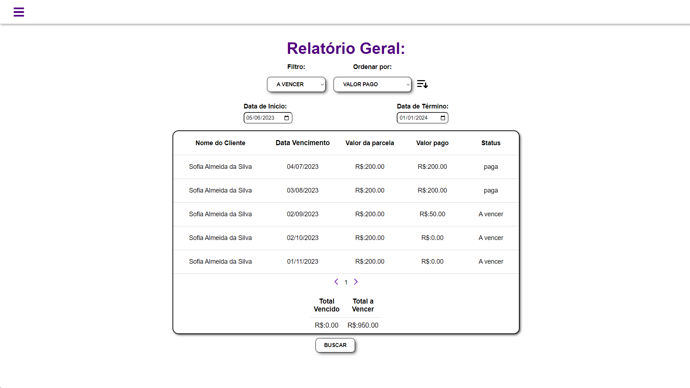

# Portfólio 3º Semestre Júlio de Paula Machado 2023

<h3>
 Sistema para Gestão de Cobranças 

 Parceiro Acadêmico: Pro4Tech
 
  
</h3>
Com o crescimento de uma empresa eventualmente registrar e analisar dados se torna uma necessidade, especialmente em campos ligados a transações monetárias com essa ideia em mente foi decidido o desenvolvimento de um sistema com a função de facilitar o gerenciamento de cobranças de uma empresa. 

## Prévia da Solução

O sistema tem a intenção de facilitar o gerenciamento de cobranças de uma empresa, em que um funcionário pode registar dados de uma compra feita por um cliente, como valor da compra, valor pago, data de pagamento, data de crédito ,além de verificar como está o status do cliente, caso ele tenha parcelas pagos dentro do prazo se tornar Adimplente e caso pague-as atrasadas ou não pague ele é registrado como Inadimplente.
Além de fornecer aos funcionários uma função de relatório sobre os dados gerais das parcelas, assim como o uma filtragem de todas em um período de tempo determinado pelo filtro, podendo ser separado em dados como relatório de vencimento, pagamento, crédito. Junto com uma função que permite ordenar os dados, por ordem crescente ou decrescente.

## Funcionalidades:

  

   <h2> Funcionalidade Registro de Compra </h2>
 

  
 

No Registro de compra um Funcionário deve utilizar o sistema para cadastrar os devidos dados de um cliente, como nome, endereço, documento e principalmente o valor da compra.

  

    <h2> Funcionalidade Listagem de Compras </h2>
 

  

Na listagem o sistema apresenta alguns dados de todas as compras realizadas pelos usuários, possuindo uma função para visualizar mais dados de um usuário selecionado, e realizar o pagamento de alguma parcela, além de contar com uma pesquisa para localizar um usuário específico.
 

  

    <h2>Funcionalidade Mostrar dados de um cliente</h2>
 

  
  

Em um Pop-up da listagem de Compras é possível ver dados de um único cliente, como Nome, documento, dados gerais da compra além de dados individuais de cada uma das parcelas.
 

  

    <h2> Funcionalidade de pagamento</h2>
  

  
  

Ao clicar no botão de pagamento na listagem permite registrar o valor pago por um cliente para cada parcela, além da data de pagamento e crédito das parcelas pendentes.
 

  

    <h2> Relatórios</h2>
  

  

Na Aba de relatórios é possível ter uma visão de como estão as transações no sistema em um período determinado pelo Usuário, nele é permitido selecionar dentre 4 opções de relatórios de vencimento, pagamento, crédito e atraso, além de poder ordenar os dados por nome do cliente, data de pagamento, valor pago, etc.
 

## Tecnologias Utilizadas:
 
<h3 align="center">Front-end</h3>

    
    
    
    
 

 <h3 align="center">Back-end</h3>
 

    
    
    
    

## Contribuições Pessoais 

Participei do Projeto como Dev Team

Meus objetivos foram a conexão inicial do Front-end com Back-end e desenvolver algumas das funcionalidades do Front-End.

Como a listagem de clientes utilizando a propriedade .map na lista de usuários recebidos pelo protocolo HTTP, junto a pesquisa de algum usuário,
criação dos modais para visualizar dados de um cliente específico.
Além de ter sido responsável pela apresentação dos relatórios, junto aos filtros e a ordenarem dos dados.

## Lições Aprendidas

Neste Projeto tive muito contato com as partes de funcionalidade do front-end, em que até dado momento eu havia feito poucas funcionalidades mais focadas em design. Além de ter aprimorado minha afinidade com a biblioteca React, e a linguagem TypeScript principalmente com itens ligados a objetos e listas, e aprofundar meus conhecimentos com protocolos HTTP que já tinha uma leva Idea antes de começar o projeto. 

 <h2> Hard Skills</h2>

<table align="center">
  <tr>
    <th width="300px">Tecnologia/Metodologia</th>
    <th width="300px">Classificação</th>
  </tr>
  <tr>
    <td>TypeScript</td>
    <td>★★★★☆</td>
  </tr>
  <tr>
    <td>Design</td>
    <td>★★★☆☆</td>
  </tr>
  <tr>
    <td>Protocolo HTTP</td>
    <td>★★★☆☆</td>
  </tr>
  <tr>
    <td>Java</td>
    <td>★★☆☆☆</td>
  </tr>
</table>

   
 <h2> Soft Skills </h2>

<table align="center">
  <tr>
    <th width="300px">Tecnologia/Metodologia</th>
    <th width="300px">Classificação</th>
  </tr>
  <tr>
    <td>Proatividade</td>
    <td>★★★☆☆</td>
  </tr>
  <tr>
    <td>Autonomia</td>
    <td>★★★☆☆</td>
  </tr>
  <tr>
    <td>Comunicação</td>
    <td>★★★☆☆</td>
  </tr>
  <tr>
    <td>Entrega de Resultado</td>
    <td>★★★★☆</td>
  </tr>
</table>

  
  
